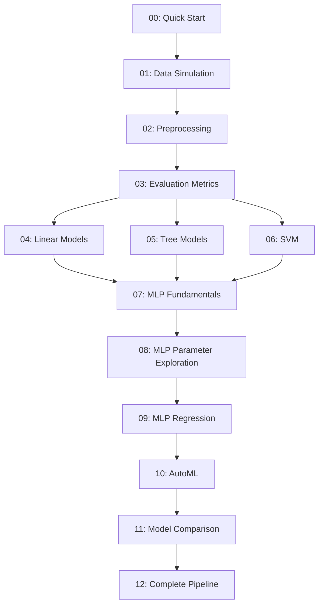

# 📚 実践教科書改善計画

## 📊 現状サマリー

- ✅ **13個のノートブック**で体系的なカリキュラム構成
- ✅ **12/13のノートブック**に学習目標とまとめがある
- ✅ 豊富な**視覚化**と**実行可能なコード**
- ⚠️ フレームワークの多くの要素が未実装

---

## 🎯 改善方針（3フェーズアプローチ）

### 【フェーズ1: 必須要素の追加】⭐ 最優先

#### 1.1 各章の冒頭に追加

```markdown
## 📋 この章で学ぶこと
- [ ] 学習目標1（具体的で測定可能に）
- [ ] 学習目標2
- [ ] 学習目標3

## 🎯 前提知識
この章を学ぶには以下の知識が必要です：
- Python基礎（変数、関数、リスト）
- NumPy基礎（配列操作）← 第X章で学習
- 線形代数の基礎知識（ベクトル、行列）← 第Y章で学習

⏱️ **推定学習時間**: 60-90分
📊 **難易度**: ★★☆☆☆（中級）
```

#### 1.2 各セクションに追加

```markdown
### 💡 モチベーション
[なぜこれを学ぶのか？実世界での応用例]

### ⚠️ よくあるエラー
**エラー1: ConvergenceWarning**
```python
# ❌ 悪い例
mlp = MLPClassifier(max_iter=100)  # 少なすぎる

# ✅ 良い例
mlp = MLPClassifier(max_iter=500, early_stopping=True)
```

**対処法**: `max_iter`を増やすか、`early_stopping=True`を使用

### 💡 ベストプラクティス
✅ **推奨**: 常に`StandardScaler()`でデータを正規化
❌ **非推奨**: 生データをそのままMLPに入力
```

#### 1.3 章末に追加

```markdown
## 🎓 自己評価クイズ

### Q1: MLPで最も重要な前処理は？
<details>
<summary>答えを見る</summary>

**答え**: 特徴量のスケーリング（StandardScaler）

**理由**: ニューラルネットワークは特徴量のスケールに敏感で、正規化しないと学習が遅くなったり、収束しなかったりします。
</details>

### Q2: [次の質問]
...

## 🏋️ 演習問題

### 基礎問題
**問題1**: `make_circles`データセットでMLPを訓練し、精度を0.95以上にしてください。

<details>
<summary>ヒント</summary>
- 隠れ層を2層にしてみましょう
- `alpha`パラメータを調整してみましょう
</details>

<details>
<summary>解答例</summary>

```python
from sklearn.datasets import make_circles
# [完全な解答コード]
```
</details>

### 応用問題
[より難しい問題]

### 🔥 チャレンジ問題
[上級者向け]
```

#### 1.4 カリキュラムマップ（全体の冒頭に）

```markdown
# 📊 学習ロードマップ



| ノートブック | 前提 | 推定時間 | 難易度 |
|------------|------|---------|--------|
| 00 | なし | 30分 | ★☆☆☆☆ |
| 01 | Python基礎 | 45分 | ★★☆☆☆ |
| ... | ... | ... | ... |
```

---

### 【フェーズ2: エンゲージメント要素の追加】

#### 2.1 コラム・読み物

各章に1-2個のコラムを追加：

```markdown
---
## 📖 コラム: なぜMLPは「万能近似定理」と呼ばれるのか？

1989年、George Cybenko は「1つの隠れ層を持つニューラルネットワークは、任意の連続関数を任意の精度で近似できる」ことを証明しました。

しかし！実際には：
- 「近似できる」≠「効率的に学習できる」
- 深いネットワークの方が少ないパラメータで複雑な関数を表現可能
- これがDeep Learningの理論的基礎に

🔗 参考文献: Cybenko (1989) "Approximation by superpositions of a sigmoidal function"
---
```

#### 2.2 インタラクティブ要素

```python
# パラメータを変えて試せるウィジェット
from ipywidgets import interact, IntSlider, FloatSlider

@interact(
    n_neurons=IntSlider(min=1, max=100, step=1, value=50),
    alpha=FloatSlider(min=0.0001, max=0.1, step=0.0001, value=0.001)
)
def train_and_plot(n_neurons, alpha):
    mlp = MLPClassifier(hidden_layer_sizes=(n_neurons,), alpha=alpha)
    mlp.fit(X_train, y_train)
    plot_decision_boundary(mlp, X, y)
    print(f"Accuracy: {mlp.score(X_test, y_test):.3f}")
```

#### 2.3 進捗管理機能

各ノートブックの最後に：

```python
# 🎯 学習進捗チェック
import json
from pathlib import Path

def mark_complete(notebook_number):
    """このノートブックを完了済みにマーク"""
    progress_file = Path("learning_progress.json")

    if progress_file.exists():
        with open(progress_file) as f:
            progress = json.load(f)
    else:
        progress = {"completed": []}

    if notebook_number not in progress["completed"]:
        progress["completed"].append(notebook_number)
        progress["completed"].sort()

    with open(progress_file, 'w') as f:
        json.dump(progress, f, indent=2)

    completion_rate = len(progress["completed"]) / 13 * 100
    print(f"🎉 Notebook {notebook_number:02d} 完了！")
    print(f"📊 全体進捗: {completion_rate:.1f}% ({len(progress['completed'])}/13)")

    # バッジ表示
    if completion_rate >= 25:
        print("🏆 バッジ獲得: ビギナー（25%達成）")
    if completion_rate >= 50:
        print("🏆 バッジ獲得: 中級者（50%達成）")
    if completion_rate >= 75:
        print("🏆 バッジ獲得: 上級者（75%達成）")
    if completion_rate >= 100:
        print("🎓 バッジ獲得: マスター（100%達成）")

# このノートブックを完了したら実行
# mark_complete(7)  # ← コメントを外して実行
```

#### 2.4 用語集

プロジェクトルートに`glossary.md`を作成：

```markdown
# 📖 用語集

## A

**Activation Function（活性化関数）**
ニューラルネットワークの各ニューロンに適用される非線形関数。ReLU、sigmoid、tanhなどがある。
📍 初出: Notebook 07

**Adam (Adaptive Moment Estimation)**
機械学習の最適化アルゴリズム。学習率を自動調整する。
📍 初出: Notebook 07

## B

**Backpropagation（誤差逆伝播法）**
...

[以下省略]
```

---

### 【フェーズ3: 高度な機能の追加】

#### 3.1 総合プロジェクト

新規ノートブック `13_capstone_project.ipynb` を作成：

```markdown
# 🎓 総合プロジェクト: Kaggleスタイルコンペティション

## ミッション
タイタニック号の乗客データから生存予測モデルを構築せよ！

### 目標
- データ探索（Notebook 01-02の知識）
- 前処理（Notebook 02の知識）
- 複数モデルの比較（Notebook 04-07の知識）
- ハイパーパラメータチューニング（Notebook 08, 10の知識）
- 完全なパイプライン構築（Notebook 12の知識）

### 段階的ガイド
1. データ読み込みと探索（30分）
2. 欠損値処理と特徴量エンジニアリング（45分）
3. ベースラインモデル構築（30分）
4. モデル改善（60分）
5. 最終評価（15分）

### 評価基準
- 🥉 Bronze: Accuracy > 0.75
- 🥈 Silver: Accuracy > 0.80
- 🥇 Gold: Accuracy > 0.85
```

#### 3.2 トラブルシューティングガイド

`troubleshooting.md` を作成：

```markdown
# 🔧 トラブルシューティングガイド

## よくあるエラーと解決法

### 1. ConvergenceWarning: Maximum iterations reached

**原因**:
- イテレーション数が不足
- 学習率が不適切
- データがスケーリングされていない

**解決法**:
1. `max_iter`を増やす（500 → 1000）
2. `early_stopping=True`を使用
3. `StandardScaler()`でデータを正規化
4. 学習率を調整（`learning_rate_init`）

**関連ノートブック**: 07, 08

---

### 2. [次のエラー]
...
```

#### 3.3 参考資料リンク集

`resources.md` を作成：

```markdown
# 📚 参考資料・さらに学ぶために

## 公式ドキュメント
- [scikit-learn ユーザーガイド](https://scikit-learn.org/stable/user_guide.html)
- [NumPy ドキュメント](https://numpy.org/doc/)

## オンラインコース
- [Coursera: Machine Learning by Andrew Ng](https://www.coursera.org/learn/machine-learning)
- [fast.ai: Practical Deep Learning](https://course.fast.ai/)

## 書籍
- 📘 "Hands-On Machine Learning" by Aurélien Géron
- 📗 "Pattern Recognition and Machine Learning" by Christopher Bishop

## データセット
- [UCI Machine Learning Repository](https://archive.ics.uci.edu/ml/)
- [Kaggle Datasets](https://www.kaggle.com/datasets)

## 論文
### 初心者向け
- [論文タイトル] - [概要]

### 中級者向け
- [論文タイトル] - [概要]
```

---

## 🚀 実装の優先順位

### 最優先（今すぐ実装）
1. ✅ 00_quick_start に学習目標を追加
2. ✅ 全ノートブックに「前提知識」「推定学習時間」「難易度」を追加
3. ✅ 全ノートブックに「よくあるエラー」セクションを追加
4. ✅ カリキュラムマップ（README.md に追加）

### 高優先（1週間以内）
5. ✅ 自己評価クイズを各章末に追加（5問程度）
6. ✅ 演習問題を各章に追加（基礎2問、応用1問、チャレンジ1問）
7. ✅ コラムを各章に1-2個追加
8. ✅ 用語集の作成

### 中優先（2週間以内）
9. ✅ 進捗管理機能の実装
10. ✅ トラブルシューティングガイドの作成
11. ✅ インタラクティブウィジェットの追加（適切な箇所に）
12. ✅ 総合プロジェクトノートブックの作成

### 低優先（時間があれば）
13. ✅ 参考資料リンク集の充実
14. ✅ アニメーション（可能な箇所に）
15. ✅ データアート・ミニゲーム
16. ✅ 多言語対応（英語版）

---

## 📋 テンプレート

### 改善版ノートブック構造

```markdown
# 第X章: [タイトル]

## 📋 この章で学ぶこと
- [ ] 具体的な目標1
- [ ] 具体的な目標2
- [ ] 具体的な目標3

## 🎯 前提知識
- 前提1
- 前提2

⏱️ **推定学習時間**: XX分
📊 **難易度**: ★★☆☆☆

---

## 1. イントロダクション

### 💡 モチベーション
[なぜ重要か]

### 🌍 実例
[具体例]

---

## 2-N. メインコンテンツ

[既存のコンテンツ]

### ⚠️ よくあるエラー
[エラーと対処法]

### 💡 ベストプラクティス
[推奨事項]

---

## 演習問題

### 基礎問題
[問題 + ヒント + 解答]

### 応用問題
[問題 + ヒント + 解答]

### 🔥 チャレンジ問題
[難問]

---

## まとめ

### ✅ 学んだこと
- ポイント1
- ポイント2
- ポイント3

### 🎓 自己評価クイズ
[5問程度]

### ➡️ 次の章へ
[次の章の紹介]

---

## 📖 コラム
[興味深い読み物]

---

## 🎯 進捗管理
```python
# mark_complete(X)  # ← コメントを外して実行
```
```

---

## 💡 推奨実装手順

1. **パイロット実装**: 1つのノートブック（例: 07_mlp_fundamentals）で全改善を試す
2. **レビュー**: ユーザーフィードバックを得る
3. **テンプレート確定**: パイロットを基に最終テンプレートを作成
4. **一括適用**: 残り12個のノートブックに適用
5. **補助ファイル作成**: 用語集、トラブルシューティング、リソースなど
6. **総合プロジェクト**: 最後に統合プロジェクトを追加

---

## 📊 成功指標

改善後、以下を測定：
- ✅ 学習完了率（何%の読者が最後まで到達したか）
- ✅ 平均学習時間（実測値 vs 推定値）
- ✅ 演習問題の正答率
- ✅ ユーザー満足度（5段階評価）
